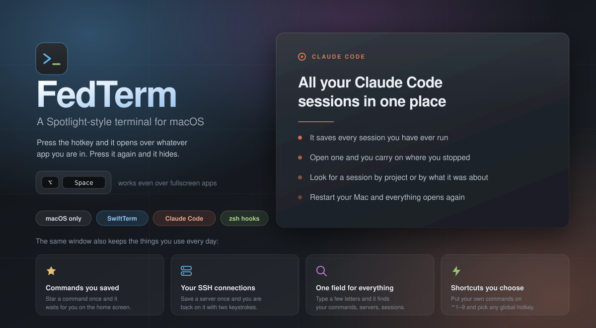
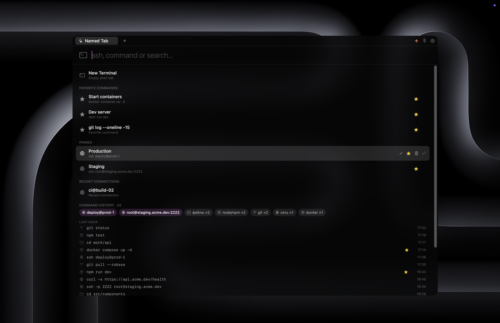

<p align="center">
  
</p>

<p align="center">
  <a href="#requirements"></a>
  <a href="Package.swift"></a>
  <a href="https://github.com/migueldeicaza/SwiftTerm"></a>
  <a href="LICENSE"></a>
</p>

FedTerm is a terminal for macOS that opens with a global shortcut. Press <kbd>⌥</kbd><kbd>Space</kbd> and a window appears on top of the app you are working in, including fullscreen apps and other desktops. Type a command, an SSH host or a folder path, press <kbd>Enter</kbd>, and the window becomes a terminal. Press the shortcut again to hide it and return focus to the previous app.

The app also records the commands you run, using a zsh hook. Because of that the same window works as a search over your command history, a list of servers you connect to, and a launcher for your [Claude Code](https://claude.com/claude-code) sessions.

FedTerm lives in the menu bar and has no Dock icon. The shortcut can be changed to any combination you like.


*The window on <kbd>⌥</kbd><kbd>Space</kbd>: search field, favourite commands, pinned servers and fresh history in one place.*

---

## Features

### The window

- The shortcut is registered through Carbon, so Accessibility permissions are not needed.
- You can rebind it in the settings. Click the field and press the keys you want. F-keys work without modifiers, other keys need at least one. If the combination is taken by another app, FedTerm says so and keeps the previous one.
- The window floats above other apps and follows you between desktops.
- It hides when you click outside of it. Pin it if you want it to stay open.
- Its size and position are remembered between launches. If the saved position is off-screen, the window opens in the centre.

### The search field

FedTerm looks at what you type and offers what fits:

| Input | Result |
| --- | --- |
| `docker compose up -d` | runs the command in a new tab |
| `deploy@prod-1` or `ssh -p 2222 host` | opens an SSH connection. Flags like `-p`, `-i`, `-J`, `-l` and `ssh://` links are parsed |
| `/Users/me/projects/api` or `~/work/api` | opens a Claude Code session in that folder |
| `dcup` | matching commands from your history |

Arrow keys move through the list, <kbd>Enter</kbd> runs the selected item, <kbd>Esc</kbd> clears the field. Matching is fuzzy, so a few letters are usually enough.


*Every command in history keeps the folder it was run from. Type `cd` and the suggestions take you straight into the folders you actually use.*

### Saved commands and connections

- **Favourite commands.** Star a command and it stays at the top of the window. You can rename it and mark it to open in its own tab when the app starts.
- **Saved SSH connections.** Pin a server and give it a label. Recent connections are collected on their own and sorted by how recently and how often you used them.
- **Command history.** Commands are grouped by age: last hour, six hours, today, yesterday, this week, older. Repeats inside a group are shown once. For the last hour there is also a short summary with counts per tool (`git`, `docker`, `ssh`, `npm` and so on) and clickable server names.


*History grouped by time, repeats collapsed, a star turns any command into a favourite.*

### Claude Code

- **Named sessions.** Drop a folder on the window or paste a path, then give the session a name. FedTerm starts it with its own session id and later resumes that exact session instead of creating a new one.
- **All past sessions.** FedTerm reads `~/.claude/projects`, takes the summary or first message of each transcript together with its folder, and lists your sessions grouped by project and by date, with a search field. Results are cached by file modification time, so the list opens without delay.
- **Clean environment.** `CLAUDE*` and `ANTHROPIC*` variables are removed from new tabs. A session started from FedTerm behaves like a standalone one even if FedTerm itself was launched from Claude Code.


*Your whole local Claude Code history, indexed and grouped by project and date, with search.*


*A session can be saved under a name — later it resumes exactly where it left off.*

### Tabs

- <kbd>⌘T</kbd> opens a tab, <kbd>⌘W</kbd> closes it, <kbd>⌘1</kbd>–<kbd>⌘9</kbd> switch between tabs, <kbd>⌘[</kbd> and <kbd>⌘]</kbd> move left and right.
- Tabs can be dragged to reorder and renamed with a double click.
- Open tabs are restored on the next launch. SSH tabs reconnect automatically.
- The tab title follows the shell: current folder, the title set by the running program, or the server name.
- If something is still running, FedTerm asks for confirmation before quitting.
- <kbd>⌘E</kbd> shows recently used tabs; <kbd>Enter</kbd> jumps back to the previous one.


*<kbd>⌘E</kbd> lists tabs by last use, the previous one is preselected — press <kbd>Enter</kbd> to jump back.*

### Custom shortcuts

A command can be bound to <kbd>⌃1</kbd>–<kbd>⌃9</kbd> together with a working directory. These shortcuts only fire while the window is open, so they do not affect other apps. Multi-line scripts are saved to a file and run through bash, so loops and conditionals work as written.

### Appearance

There are 13 built-in themes: the Terminal.app palette, One Dark, Dracula, Nord, Gruvbox, both Solarized variants, Tokyo Night, Catppuccin Mocha, Monokai, GitHub Light and two neutral greys. Any theme can be copied and edited: background, text, caret, selection, all 16 ANSI colours and background transparency over the blur. Font family, size and weight are configurable. There is also a thin strokes option for crisper text and a slider that darkens the glass over light wallpapers. Changes apply to open terminals immediately.


*Theme, font and window settings — changes apply to open terminals right away.*

### The terminal

The terminal is [SwiftTerm](https://github.com/migueldeicaza/SwiftTerm): xterm-256color, truecolor and mouse support. <kbd>⌘</kbd>-click opens links, file paths and OSC 8 hyperlinks. The scrollbar gutter is removed, so full-width programs like `mc` and `htop` use the entire width. <kbd>⌃C</kbd> is written directly to the pty, so it always interrupts. Shortcuts are matched by physical key code and keep working on Cyrillic and other non-Latin layouts. The interface is in Russian on Russian systems and in English everywhere else.

---

## Requirements

- macOS 13 Ventura or newer, Apple Silicon or Intel
- Full Xcode with Swift 5.9 or newer. Command Line Tools alone are not enough: SwiftTerm compiles a Metal shader during the build, and the `metal` compiler ships only with Xcode. Point the tools at it with `sudo xcode-select -s /Applications/Xcode.app`. On Xcode 26 the Metal toolchain is a separate download: `xcodebuild -downloadComponent MetalToolchain`
- zsh, the default shell on macOS. Command history is captured through it
- The [`claude`](https://claude.com/claude-code) CLI in your `PATH` for the Claude Code features

## Installing

```bash
git clone https://github.com/feddot2517/fedterm.git
cd fedterm
make bundle          # builds the release binary and assembles dist/FedTerm.app
open dist/FedTerm.app
```

`make run` does both steps at once. `make dev` runs the app from source without building a bundle.

The binary is signed ad-hoc, so Gatekeeper will block the first launch. Right-click the app and choose **Open**, or remove the quarantine flag:

```bash
xattr -dr com.apple.quarantine dist/FedTerm.app
```

Move the app to `/Applications` and add it to **System Settings → General → Login Items** to have it running all the time.

## Shortcuts

| Shortcut | Action |
| --- | --- |
| <kbd>⌥</kbd><kbd>Space</kbd> | show or hide the window (rebindable) |
| <kbd>Enter</kbd> | run the selected item |
| <kbd>↑</kbd> <kbd>↓</kbd> | move through results and history |
| <kbd>Esc</kbd> | clear the field |
| <kbd>⌘T</kbd> / <kbd>⌘W</kbd> | open or close a tab |
| <kbd>⌘1</kbd>–<kbd>⌘9</kbd> | switch to a tab |
| <kbd>⌘[</kbd> / <kbd>⌘]</kbd> | previous or next tab |
| <kbd>⌘E</kbd> | recently used tabs |
| <kbd>⌃1</kbd>–<kbd>⌃9</kbd> | run a custom command |
| <kbd>⌘+</kbd> / <kbd>⌘-</kbd> / <kbd>⌘0</kbd> | font size up, down, reset |
| <kbd>⌘</kbd>-click | open a link or path from the output |
| <kbd>⌃C</kbd> | interrupt the running program |

## Data

All files are local, in `~/Library/Application Support/FedTerm/`:

| File | Contents |
| --- | --- |
| `history.jsonl` | commands with timestamp and working directory |
| `pins.json`, `favorites.json` | saved servers and favourite commands |
| `state.json` | open tabs for the next launch |
| `automations.json`, `scripts/` | custom <kbd>⌃1</kbd>–<kbd>⌃9</kbd> commands and generated scripts |
| `claude_sessions.json`, `claude_index.json` | named Claude sessions and the transcript title cache |
| `custom_themes.json` | user themes |
| `zdotdir/` | generated zsh files that source your own config and add the history hook |

The app has no networking code, so nothing is uploaded and there is no telemetry. History is a plain text file and can be deleted at any time.

Note that commands are stored exactly as typed. If you paste a token or password inline, it will be in the file. Treat it like `~/.zsh_history`.

## Project structure

```
Sources/FedTerm/
├─ main.swift, AppDelegate.swift        startup, menu bar, window shortcuts
├─ SpotlightPanel.swift                 floating window, blur, saved position
├─ ContentView.swift, TabsModel.swift   tab bar, reordering, persisted state
├─ HomeView.swift                       search field, results, history
├─ TerminalSession.swift                SwiftTerm subclass, shell process, ⌘-click
├─ HistoryStore.swift                   reading and watching history.jsonl
├─ ShellIntegration.swift               generated zsh config with the preexec hook
├─ ClaudeStore.swift, ClaudeUI.swift    Claude Code sessions and their browser
├─ AutomationsStore.swift, AutomationEditor.swift   custom ⌃1–9 commands
├─ FavoritesStore.swift                 favourite commands and autostart
├─ Theme.swift, ThemeEditor.swift, SettingsUI.swift   themes, fonts, settings
├─ HotkeyManager.swift, HotkeyRecorder.swift   global shortcut and rebinding
├─ Models.swift                         SSH parsing and command classification
└─ L10n.swift                           Russian and English strings
```

## Credits

- [SwiftTerm](https://github.com/migueldeicaza/SwiftTerm) by Miguel de Icaza does the terminal emulation.
- Colour schemes are taken from One Dark, Dracula, Nord, Gruvbox, Solarized, Tokyo Night, Catppuccin and Monokai.

## License

[MIT](LICENSE)
